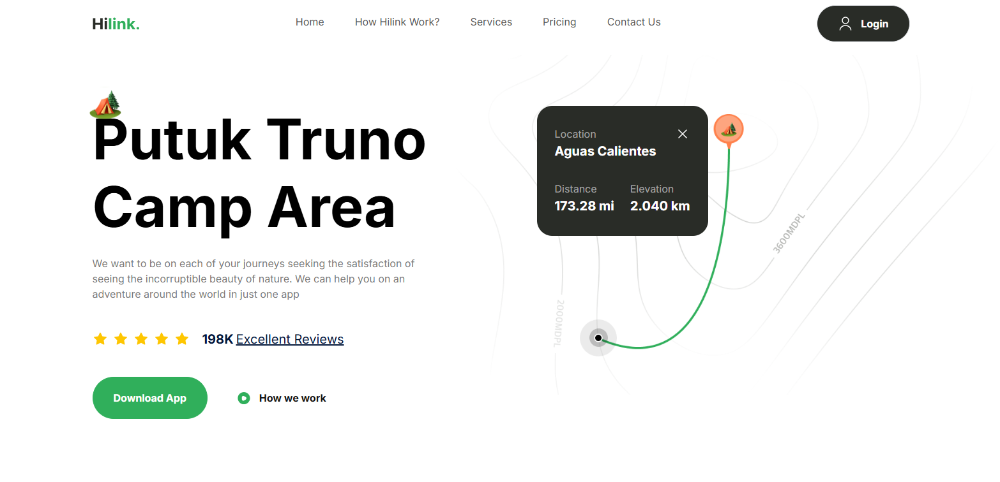

# Description

## ⛺ Camping App 
Website dedicated to camping enthusiasts and outdoor adventurers. This platform allows users to discover the best hiking trails in renowned locations and national parks, making it easier to plan unforgettable camping experiences. **Built with Next.js**, it leverages the power of **server-side rendering** and dynamic routing for a fast and seamless user experience. The project also incorporates **Tailwind CSS** to ensure a clean, modern, and fully **responsive design** that adapts effortlessly to all devices. Whether you're a seasoned explorer or a beginner seeking your first adventure, CampExplorer is your ultimate guide to the great outdoors.

# Main Features
- **Next.js**
- **Tailwind**
- **TypeScript**
- **Responsive design**
- **UI/UX design**

# 📷 Screenshot

